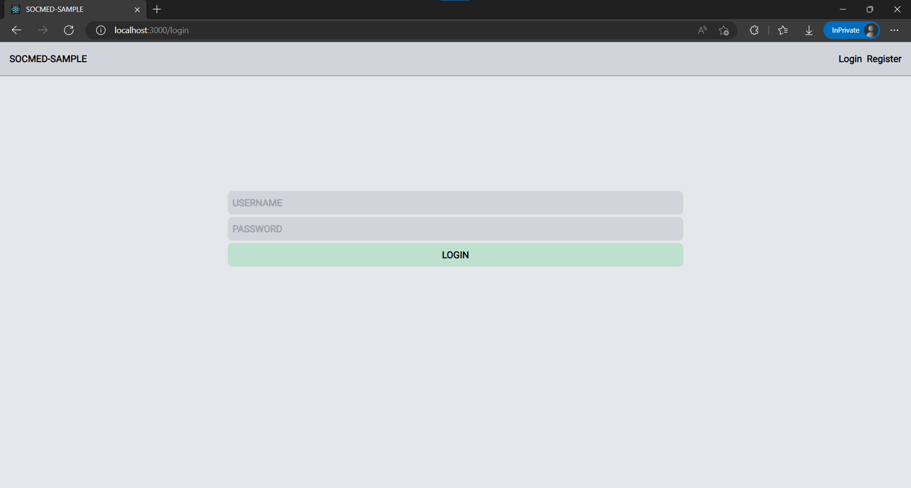
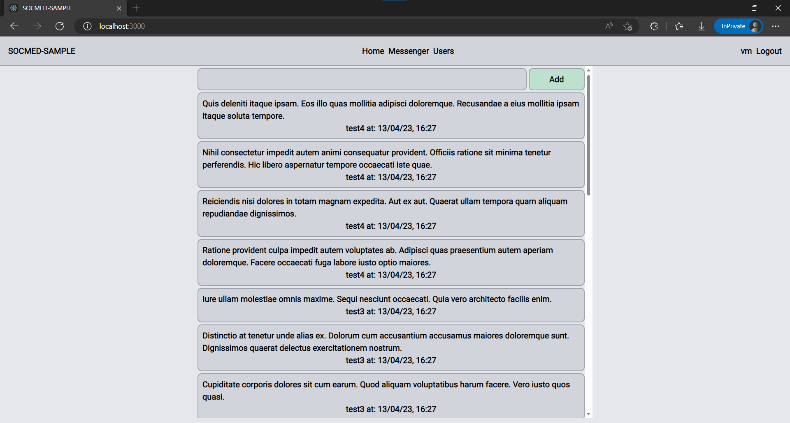
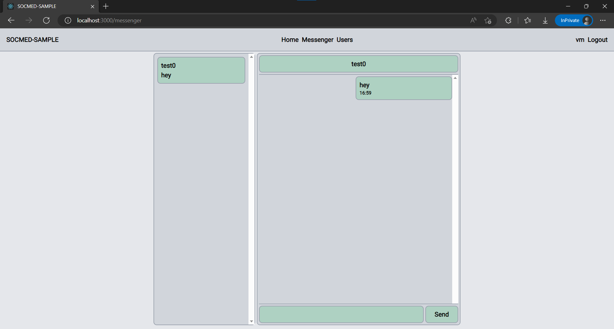
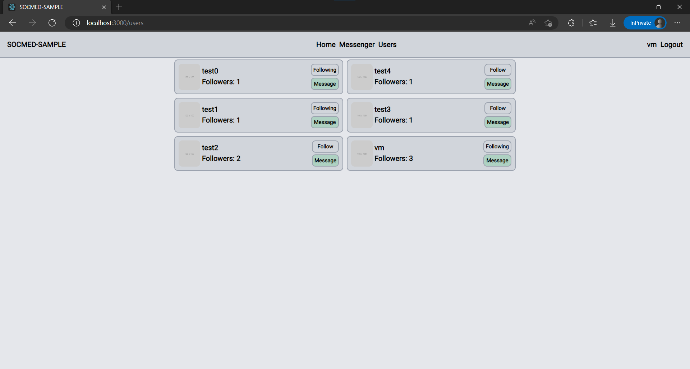
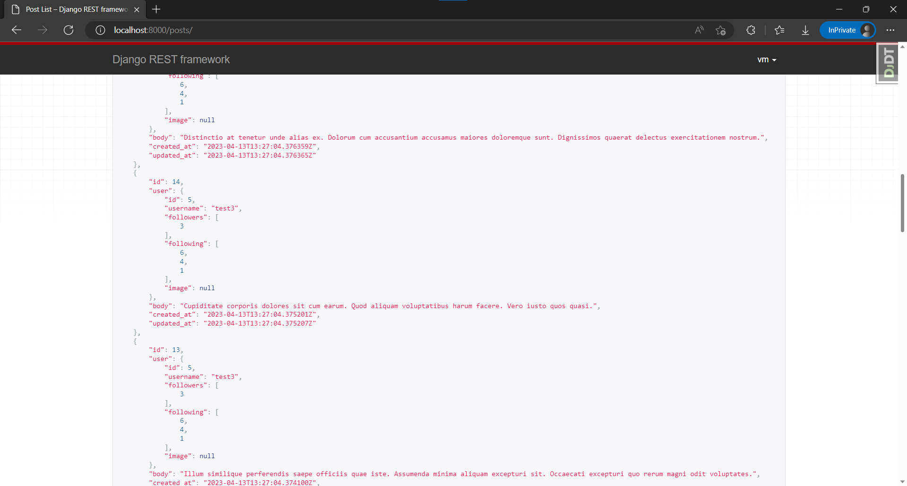
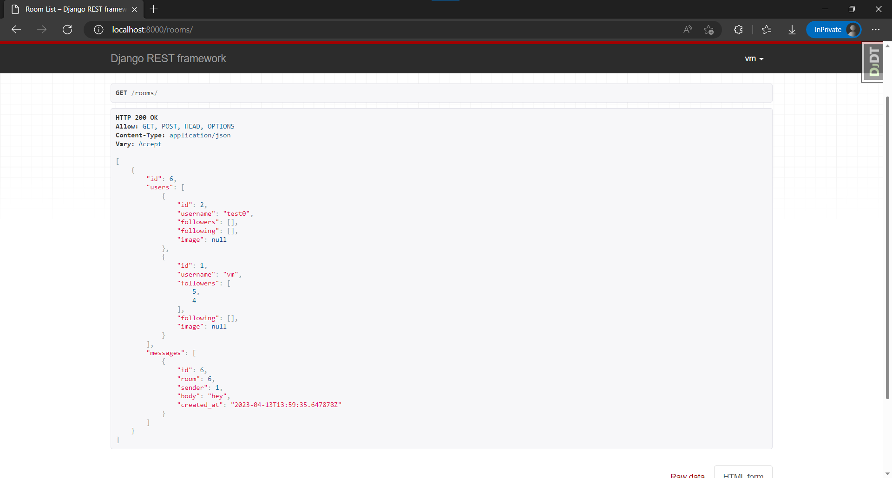

[](https://github.com/lyingtakemura/socmed-sample/actions/workflows/main.yaml)
[](https://github.com/psf/black)
[](https://github.com/PyCQA/bandit)

###### LOCALHOST
```
poetry shell
poetry install
poetry update

black . --verbose --diff --exclude /migrations/
flake8 .
bandit .

manage.py seed
```

###### DOCKER
```
pip freeze > requirements.txt (dependency list for docker)
rm -rf volumes (previous docker image state will block compose up on rebuild)
docker compose up
```






