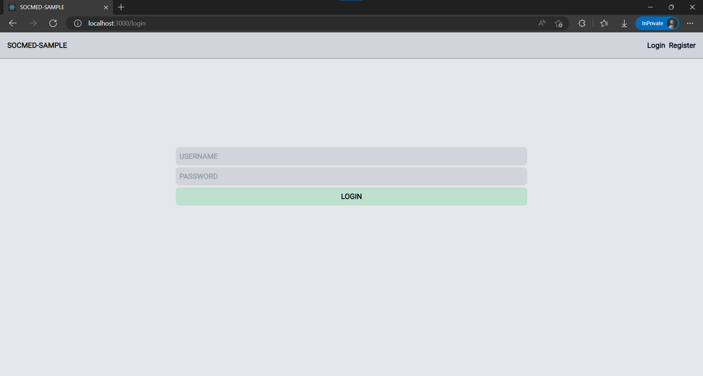
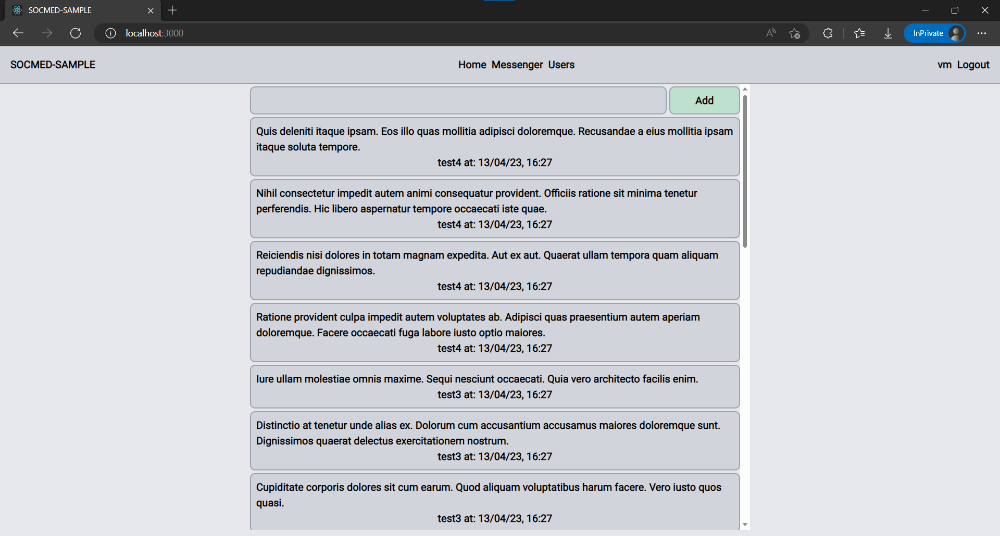
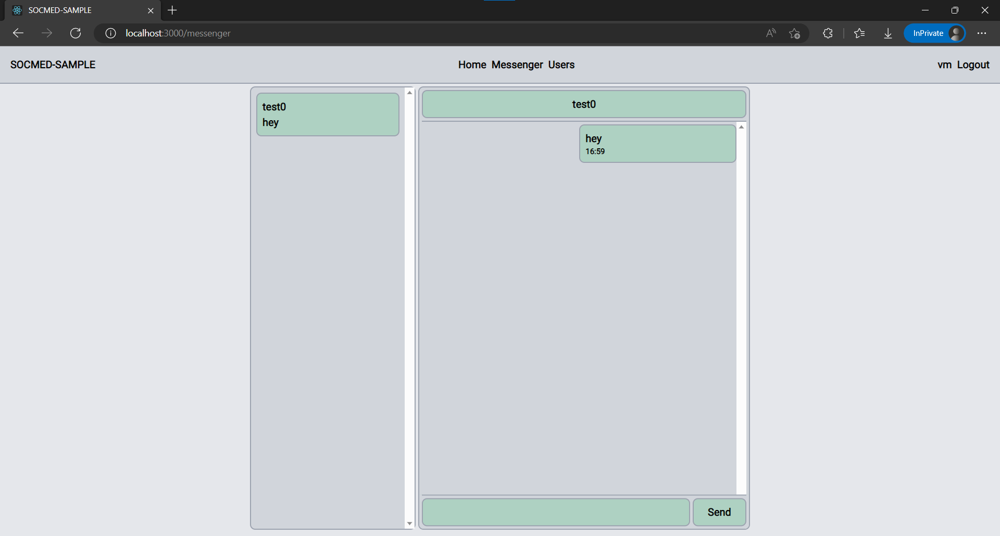
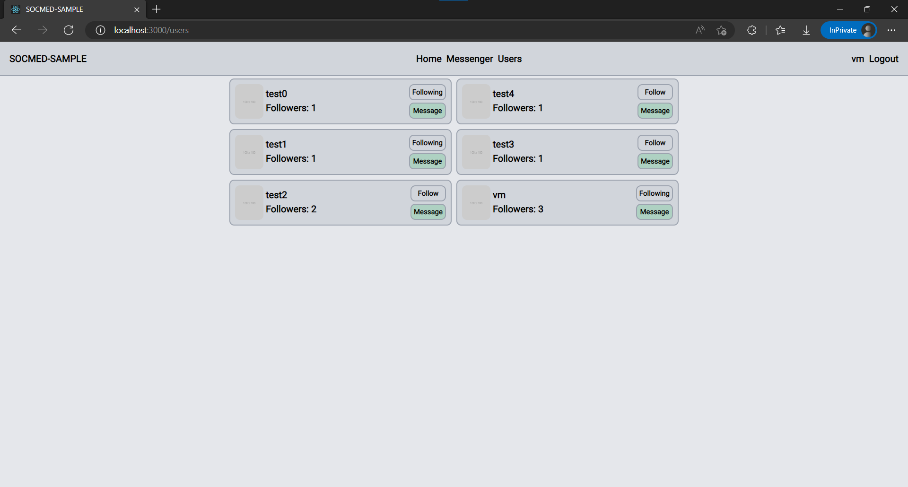
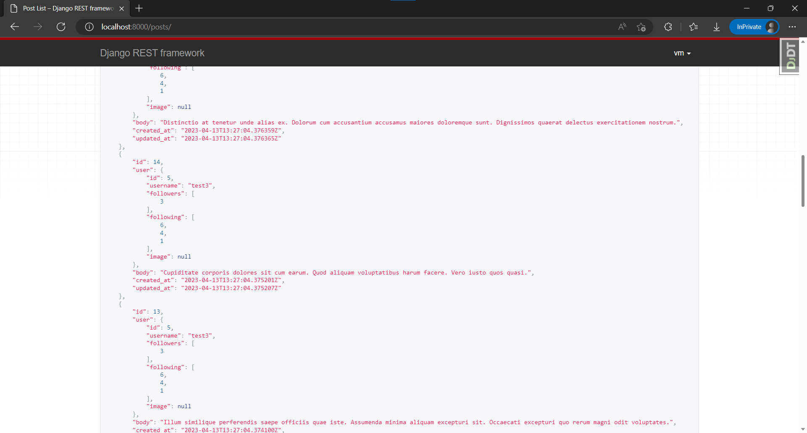
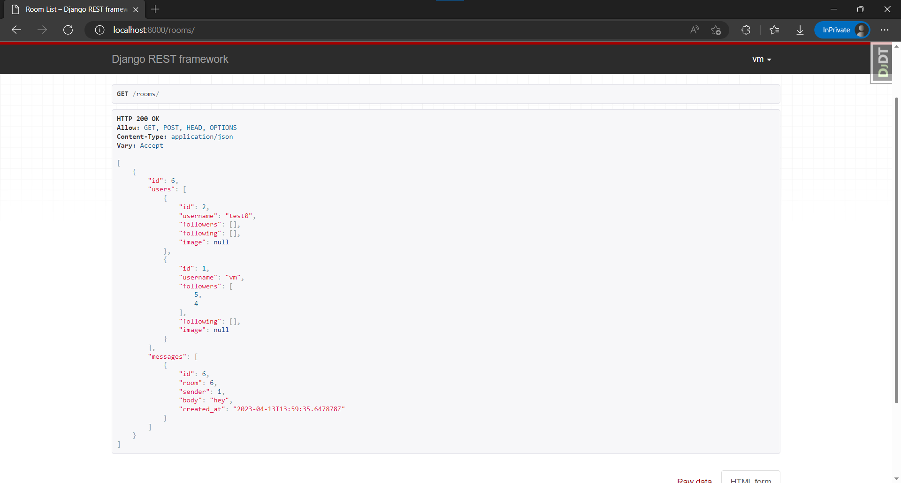

[](https://github.com/lyingtakemura/socmed-sample/actions/workflows/main.yaml)
[](https://github.com/psf/black)
[](https://github.com/PyCQA/bandit)

```
poetry shell
poetry install
poetry update

black . --verbose --diff --exclude /migrations/
flake8 .
bandit .

manage.py seed

docker:
pip freeze > requirements.txt (dependency list for docker)
sudo rm -rf volumes (remove previous docker images state on rebuild, will block compose up otherwise)
docker compose up







```
